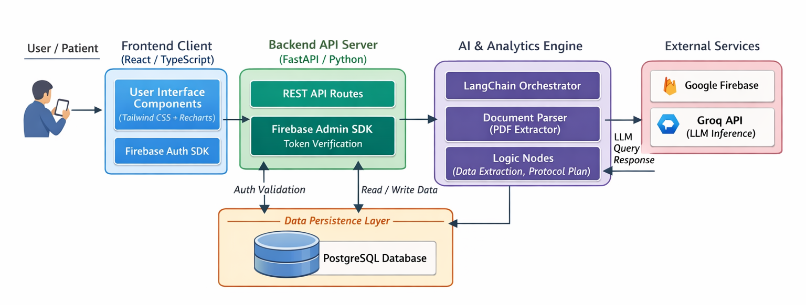

<div align="center">

# 🩺 GlucoGuide AI

### Your Intelligent Metabolic Operating System

**GlucoGuide AI** is a full-stack, AI-powered diabetes management platform that transforms raw clinical lab reports into personalized lifestyle intervention plans. Upload your PDF reports, track daily health metrics, manage medications, chat with an AI health assistant, and receive intelligent recommendations — all in one place.

[Features](#-features) · [Screenshots](#-screenshots) · [Architecture](#-architecture) · [Getting Started](#-getting-started) · [API Reference](#-api-reference)

</div>

---

## ✨ Features

| Feature | Description |
|---------|-------------|
| 📄 **Clinical Report Analysis** | Upload PDF lab reports — the AI extracts HbA1c, fasting blood sugar, lipid profiles, and blood pressure automatically |
| 🤖 **AI Lifestyle Plans** | LangChain + Groq LLM generates structured 7-week intervention plans covering diet, exercise, and restrictions |
| 💬 **AI Health Chatbot** | Context-aware chatbot with access to your clinical data, daily logs, medications, and lifestyle plan for personalized health Q&A |
| 📊 **Daily Health Tracking** | Log exercise, steps, sleep, glucose, diet quality, and alcohol intake with automatic adherence scoring |
| 💊 **Medication Management** | Track prescriptions with dosage, frequency, and daily taken/not-taken status |
| 📈 **Interactive Dashboard** | Visualize BMI, glucose trends, and adherence history with Recharts-powered charts |
| 🔐 **Secure Authentication** | Google sign-in via Firebase Auth, validated server-side with Firebase Admin SDK |
| 🇮🇳 **Indian Diet Localization** | Food and nutrition recommendations tailored for Indian dietary patterns |
| 📝 **Weekly AI Feedback** | Automatic trend analysis (Improving / Stable / Declining) with personalized feedback |

---

## 🎥 Demo Video

https://github.com/user-attachments/assets/8dd12e5b-e288-4332-ba8f-b583c3410d21

---

## 🏗 Architecture



</div>

---

**Data Flow:** User interacts with the React frontend → REST API calls to FastAPI backend → Authentication verified via Firebase → Data persisted in PostgreSQL → AI inference via LangChain + Groq for report analysis and recommendation generation.

---

## 🛠 Technology Stack

| Layer | Technologies |
|-------|-------------|
| **Frontend** | React 19, Vite, TypeScript, Tailwind CSS, Recharts, Lucide Icons |
| **Backend** | FastAPI, Python, Pydantic, SQLAlchemy, Gunicorn |
| **AI Engine** | LangChain, Groq API (LLM inference) |
| **Authentication** | Firebase Auth (client-side), Firebase Admin SDK (server-side) |
| **Database** | PostgreSQL |
| **PDF Processing** | PyPDF |
| **Observability** | LangSmith (optional tracing) |

---

## 📁 Project Structure

```
glucoguide-ai/
├── glucoguide-ai-backend/
│   ├── app/
│   │   ├── agent/                          # AI engine
│   │   │   ├── llm.py                      # Groq LLM client
│   │   │   ├── extraction_node.py          # Clinical data extraction
│   │   │   ├── plan_node.py                # 7-week lifestyle plan generation
│   │   │   ├── daily_recommendation_node.py # Daily recommendations
│   │   │   ├── feedback_node.py            # Weekly trend feedback
│   │   │   └── pdf_extractor.py            # PDF text extraction
│   │   ├── routes/                         # API endpoints
│   │   │   ├── report_routes.py            # Report upload & analysis
│   │   │   ├── log_routes.py               # Daily log CRUD & feedback
│   │   │   ├── recommendation_routes.py    # AI recommendations
│   │   │   ├── medication_routes.py        # Medication management
│   │   │   └── chat_routes.py              # AI health chatbot
│   │   ├── utils/scoring.py                # Adherence score calculation
│   │   ├── database.py                     # DB connection setup
│   │   ├── models.py                       # SQLAlchemy ORM models
│   │   ├── firebase_auth.py                # Firebase token validation
│   │   └── main.py                         # FastAPI app entry point
│   ├── .env.example                        # Environment variable template
│   ├── serviceAccountKey.example.json      # Firebase key template
│   └── requirements.txt                    # Python dependencies
│
├── glucoguide-ai-frontend/
│   ├── src/
│   │   ├── pages/                          # Route-level components
│   │   │   ├── Dashboard.tsx
│   │   │   ├── SubmitReport.tsx
│   │   │   ├── DailyLog.tsx
│   │   │   ├── MedicineTracker.tsx
│   │   │   ├── Chatbot.tsx                 # AI health chat interface
│   │   │   └── Login.tsx
│   │   ├── components/                     # Reusable UI components
│   │   ├── services/                       # Firebase & API service layer
│   │   ├── App.tsx                         # Root component with routing
│   │   └── main.tsx                        # Entry point
│   ├── package.json
│   ├── tailwind.config.js
│   ├── tsconfig.json
│   └── vite.config.ts
│
├── sample-diabetes-reports/                # Sample PDF reports for testing
├── screenshots/                            # App screenshots
├── .gitignore
└── README.md
```

---

## 🚀 Getting Started

### Prerequisites

Make sure you have the following installed on your machine:

| Tool | Version | Link |
|------|---------|------|
| **Node.js** | v18 or higher | [nodejs.org](https://nodejs.org/) |
| **npm** | v9 or higher (comes with Node.js) | — |
| **Python** | 3.10 or higher | [python.org](https://www.python.org/) |
| **PostgreSQL** | 14 or higher | [postgresql.org](https://www.postgresql.org/download/) |
| **Git** | any recent version | [git-scm.com](https://git-scm.com/) |

You will also need:

- A **Firebase project** with Authentication (Google provider) enabled → [Firebase Console](https://console.firebase.google.com/)
- A **Groq API key** → [console.groq.com](https://console.groq.com)
- *(Optional)* A **LangSmith API key** for tracing → [smith.langchain.com](https://smith.langchain.com)

---

### Step 1 — Clone the Repository

```bash
git clone https://github.com/yashpawar87/glucoguide-ai.git
cd glucoguide-ai
```

---

### Step 2 — Set Up PostgreSQL Database

Create a new database for the application:

```bash
# Open the PostgreSQL shell
psql -U postgres

# Inside the shell, create the database
CREATE DATABASE glucoguide;

# Exit
\q
```

> **Note:** The backend will auto-create all tables on first startup using SQLAlchemy.

---

### Step 3 — Backend Setup

```bash
cd glucoguide-ai-backend
```

#### 3.1 — Create a Python virtual environment

```bash
python3 -m venv venv
source venv/bin/activate        # macOS / Linux
# venv\Scripts\activate          # Windows
```

#### 3.2 — Install Python dependencies

```bash
pip install -r requirements.txt
```

#### 3.3 — Configure environment variables

```bash
cp .env.example .env
```

Open `.env` and fill in your credentials:

```env
DATABASE_URL=postgresql://<user>:<password>@localhost:5432/glucoguide
GROQ_API_KEY=<your_groq_api_key>

# Optional: LangSmith tracing
LANGCHAIN_TRACING_V2=true
LANGCHAIN_ENDPOINT=https://api.smith.langchain.com
LANGCHAIN_API_KEY=<your_langsmith_api_key>
LANGCHAIN_PROJECT=glucoguide-ai
```

| Variable | Required | Description |
|----------|----------|-------------|
| `DATABASE_URL` | ✅ | PostgreSQL connection string |
| `GROQ_API_KEY` | ✅ | API key from [console.groq.com](https://console.groq.com) |
| `LANGCHAIN_API_KEY` | ❌ | LangSmith tracing key (optional) |

#### 3.4 — Add Firebase Admin SDK credentials

```bash
cp serviceAccountKey.example.json serviceAccountKey.json
```

Replace the placeholder values in `serviceAccountKey.json` with your real Firebase Admin SDK service account key.

> **How to get it:** Firebase Console → Project Settings → Service Accounts → Generate new private key → Download JSON.

---

### Step 4 — Frontend Setup

```bash
cd ../glucoguide-ai-frontend
npm install
```

#### 4.1 — Configure Firebase (client-side)

Open `src/services/firebase.tsx` and update the Firebase config object with your project credentials:

```typescript
const firebaseConfig = {
  apiKey: "YOUR_API_KEY",
  authDomain: "YOUR_PROJECT.firebaseapp.com",
  projectId: "YOUR_PROJECT_ID",
  storageBucket: "YOUR_PROJECT.appspot.com",
  messagingSenderId: "YOUR_SENDER_ID",
  appId: "YOUR_APP_ID",
};
```

> **How to get it:** Firebase Console → Project Settings → General → Your apps → Web app config.

---

### Step 5 — Run the Application

Open **two terminal windows** — one for the backend, one for the frontend.

**Terminal 1 — Start the backend:**

```bash
cd glucoguide-ai-backend
source venv/bin/activate
uvicorn app.main:app --reload
```

> ✅ API server starts at [`http://localhost:8000`](http://localhost:8000)
> 📖 Swagger docs at [`http://localhost:8000/docs`](http://localhost:8000/docs)

**Terminal 2 — Start the frontend:**

```bash
cd glucoguide-ai-frontend
npm run dev
```

> ✅ Dev server starts at [`http://localhost:5173`](http://localhost:5173)

---

## 🔧 Troubleshooting

| Issue | Solution |
|-------|---------|
| `ModuleNotFoundError` in Python | Make sure your virtual environment is activated (`source venv/bin/activate`) |
| Database connection refused | Ensure PostgreSQL is running and `DATABASE_URL` in `.env` is correct |
| Firebase auth errors | Verify `serviceAccountKey.json` has valid credentials and matches your Firebase project |
| Port 8000 already in use | Kill the existing process: `lsof -ti:8000 \| xargs kill` or use `--port 8001` |
| Port 5173 already in use | Kill the existing process or run `npm run dev -- --port 5174` |
| CORS errors in browser | Make sure the frontend URL is listed in `main.py` CORS origins |
| Groq API rate limit | Wait a moment and retry — free tier has rate limits |

---

## 📡 API Reference

Once the backend is running, interactive API docs are available at:

- **Swagger UI:** [`http://localhost:8000/docs`](http://localhost:8000/docs)

### Core Endpoints

| Method | Endpoint | Description |
|--------|----------|-------------|
| `GET` | `/` | Health check |
| `GET` | `/me` | Get authenticated user profile |
| `POST` | `/reports/upload` | Upload a PDF clinical report for AI analysis |
| `GET` | `/recommendations/daily` | Retrieve daily AI-powered recommendations |
| `POST` | `/logs/` | Create or update a daily health log |
| `GET` | `/logs/history` | Get recent log history |
| `GET` | `/logs/weekly` | Get weekly adherence summary |
| `GET` | `/logs/feedback` | Get AI-generated weekly feedback |
| `POST` | `/chat/message` | Send a message to the AI health chatbot |
| `GET` | `/medications/` | List all medications |
| `POST` | `/medications/` | Add a new medication |
| `PUT` | `/medications/{id}/toggle` | Toggle medication taken status |
| `DELETE` | `/medications/{id}` | Delete a medication |

---

<div align="center">

Made with ❤️ for better diabetes management

</div>
